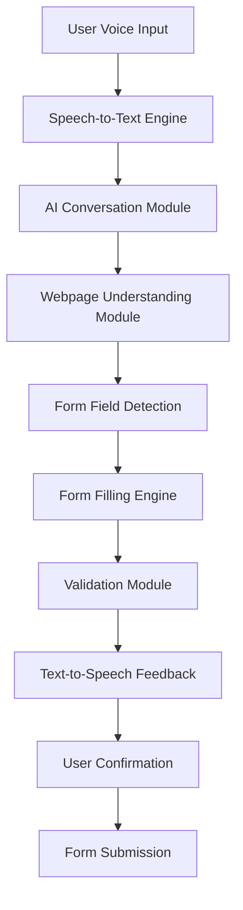

# Architecture

## Overview

VisionAI Browser is split into four main runtime layers:

1. Browser-hosted React frontend for the assistant and form-review experience.
2. FastAPI backend for orchestration, validation, and session state.
3. AI services for optional server-side speech recognition, language understanding, and text-to-speech.

## Data flow

## Main responsibilities

- `frontend/` renders the assistant, history, and submission summary.
- `backend/` exposes APIs for form schemas, validation, and conversation state.
- `ai/` contains reusable helpers for speech and prompt-driven field extraction.
- The frontend uses the browser Web Speech API for immediate voice input; Faster-Whisper is available through `ai/app/main.py` when server-side transcription is needed.

## Safety boundaries

- The assistant requests confirmation before submission.
- CAPTCHA solving is not automated.
- Sensitive values should only be filled after explicit user confirmation.
